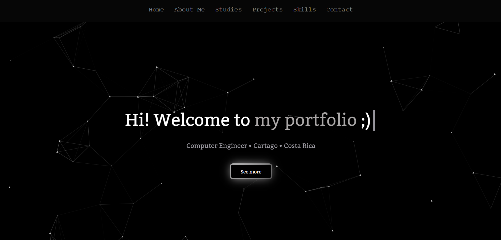

# 💼 My portfolio

 
This is my portfolio, where I showcase my projects and skills as a developer. It includes a brief introduction about me, my projects, and my contact information and more.
 
 
📌 You can visit it at:  
 
https://keyner-mena.github.io/portfolio/

 

---

# 📸 Screenshots

 
